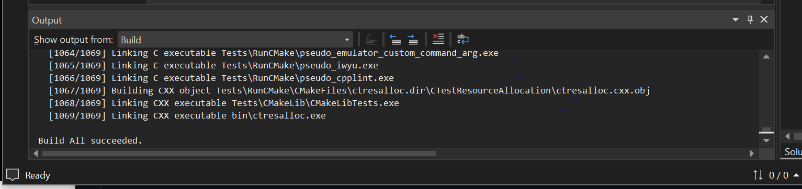
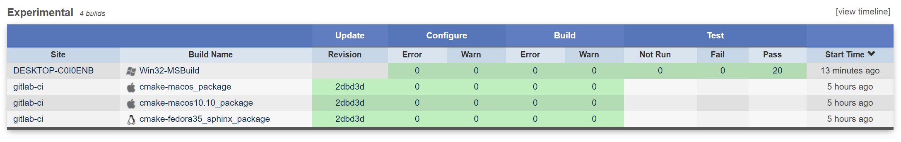
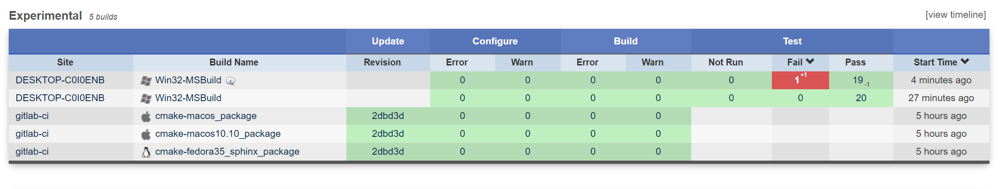
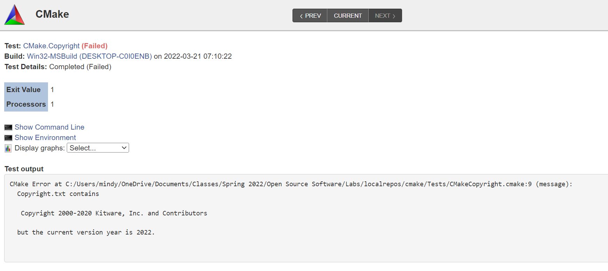
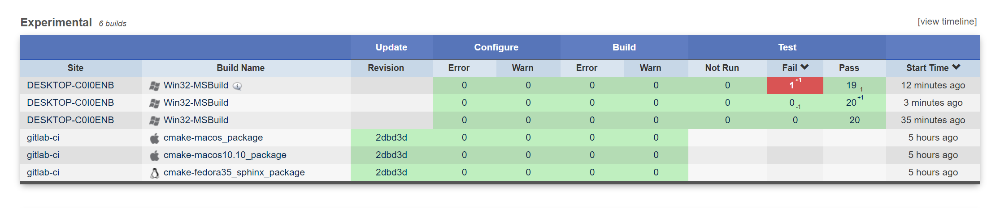
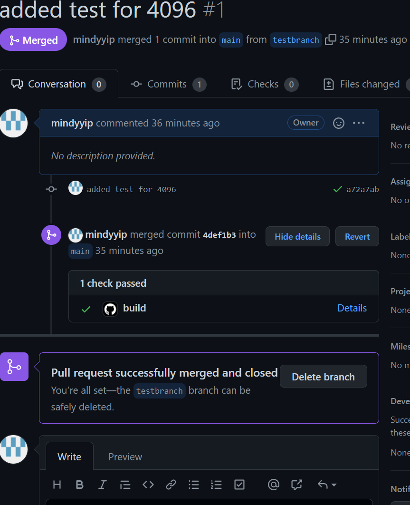
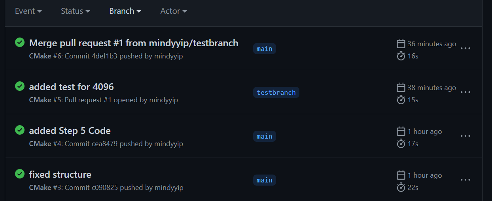

# Lab 8

## Checkpoint 1

## Checkpoint 2

For the Nightly and Experimental sections, the tests can be seen by going to either section and selecting one of the build names. There should be a table on the next site that lists all of the current builds. There is a row specifically for Test, and clicking on that row should a test summary.

There is a failure in the Nightly Expected table with the cygwin64-make build. There was a failed test with the RunCMake.CTestCommandLine. I can see the error conditions by clicking further into the details and reading the test output and seeing what failed.

The Master cmake-windows_vs2022_x64 build is similar to my system. The dashboard is very clean with no errors and there is nothing to be concerned about.

After running the CMake tests, there were no errors.

## Checkpoint 3

### Submission with Errors

### Error Message

The error message had to do with the copyright because the years were not correct. I changed the 2020 to 2022 so that it would reflect the correct year.

### Fixed Error Submission

## Checkpoint 4

### Link to CMake Step 5 Repo

[CMake Step 5](https://github.com/mindyyip/cmake5)

